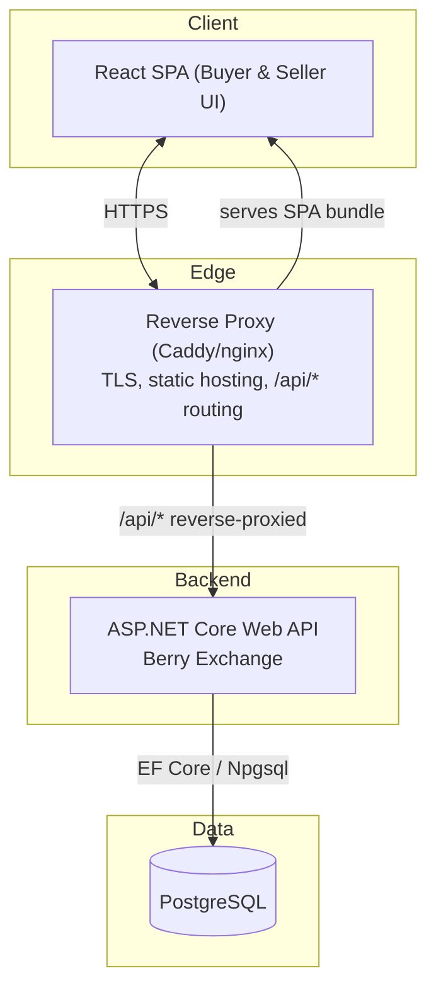
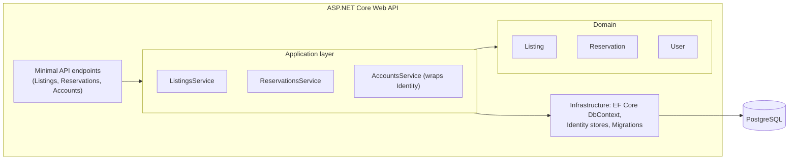
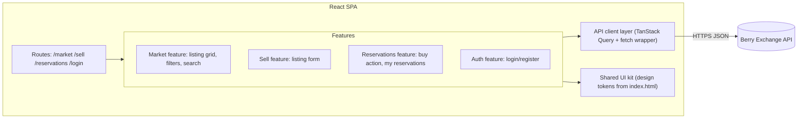
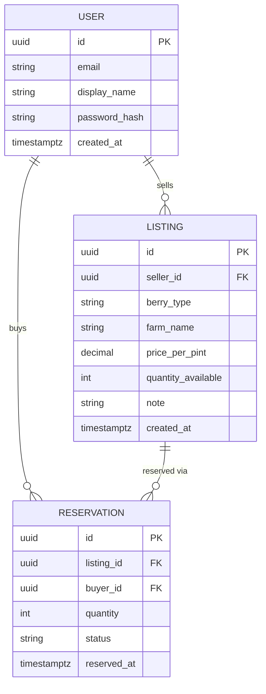
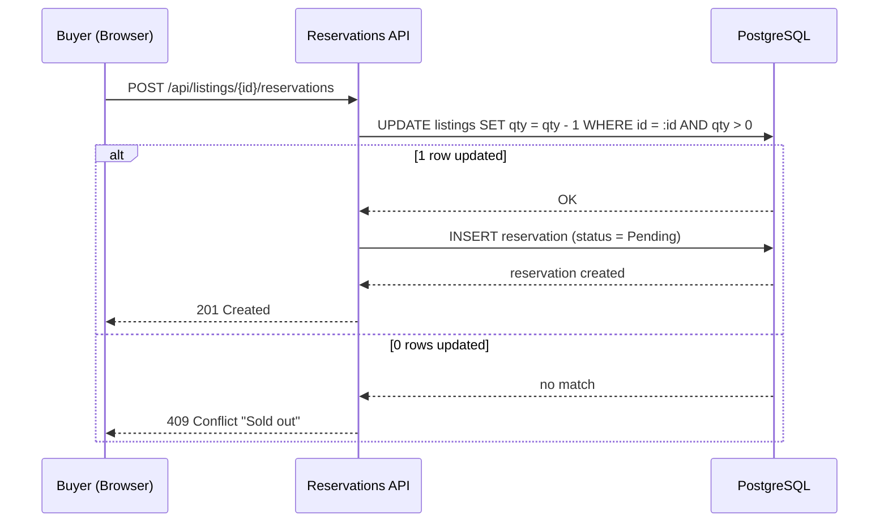
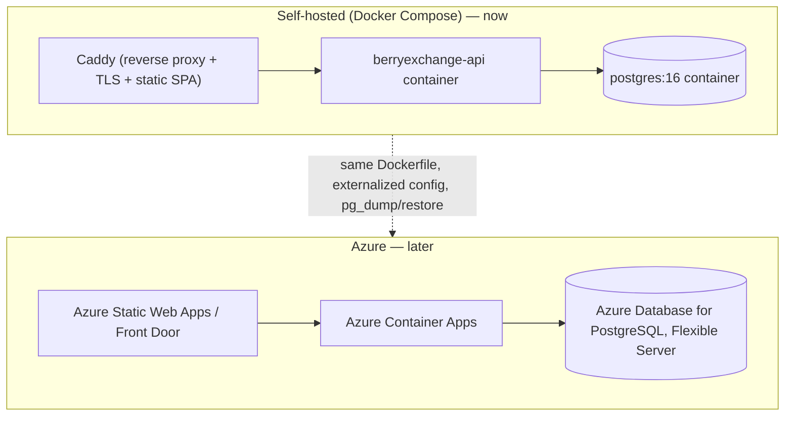

# Berry Exchange — Architecture Design

Date: 2026-07-20
Status: Approved

This is a point-in-time design spec. Diagrams embedded below are a snapshot from design time; the canonical, continuously-updated versions live in `docs/architecture/*.mmd` and are what the freshness mechanism (ADR-0006) actually enforces going forward. If the two ever disagree, `docs/architecture/*.mmd` wins.

## Purpose and scope

Berry Exchange ("Berrow") is currently a single-file, client-only HTML prototype (`index.html`) that demonstrates the intended UX: browsers filter/search berry listings, post a listing, and reserve ("buy") a pint, decrementing stock and tracking a basket count — all via `localStorage`, no backend.

This spec designs the real system behind that UX:

- **Scale**: a real MVP for a solo developer, not a portfolio piece — built to survive actual usage, not just demo well.
- **Payments**: reservation-only. The platform lets a buyer claim a pint; payment and pickup happen off-platform between buyer and seller, same as handing over cash at a farm stand. No payment-processor integration, no PCI/escrow surface.
- **Hosting**: self-hosted today (Docker Compose), with a planned migration to Azure once the marketplace has traction.
- **Frontend**: no existing team preference — chosen on technical merit.
- **Team**: solo developer.

## Architecture style

Berry Exchange is built as a **modular monolith**: one ASP.NET Core Web API deployable unit, one PostgreSQL database, three internal modules (Listings, Reservations, Accounts) that only talk to each other through service interfaces. See ADR-0001 for the full reasoning and rejected alternatives (microservices, serverless).

## System overview

Canonical source: `docs/architecture/context.mmd` (C4 Level 1) and `docs/architecture/container.mmd` (C4 Level 2).

One deployable API, one Postgres instance, a thin reverse proxy that serves the built SPA and forwards `/api/*` to the backend — same-origin, which matters for cookie-based auth (ADR-0004).

## Database: PostgreSQL

See ADR-0002. Free to self-host, first-class EF Core provider, direct migration path to Azure Database for PostgreSQL Flexible Server, and full transactional guarantees for the atomic stock-decrement the reservation flow depends on.

## Frontend: React + TypeScript + Vite

See ADR-0003. Weighed against Blazor (stay all-.NET) and Vue (simpler learning curve). The UI is CRUD/forms/filtering-heavy — React's strong suit — and the existing prototype's CSS custom properties and component-shaped markup translate directly into React components with minimal redesign.

## Backend modules and data model

Canonical source: `docs/architecture/component-backend.mmd`.

Three modules — **Listings**, **Reservations**, **Accounts** — each a self-contained folder (endpoints + service + DTOs). They only call each other through service interfaces, never reach into another module's EF entities directly. That boundary is the seam that would let a module split into its own service later without a rewrite.

### Frontend components

Canonical source: `docs/architecture/component-frontend.mmd`.

### Data model

Canonical source: `docs/architecture/data-model.mmd`.

Any authenticated `User` can both list and reserve berries — matching the prototype's lack of a rigid buyer/seller role split, minus being able to reserve one's own listing. `berry_type` stays free text like today's prototype; filter chips are derived from distinct values in use, not a fixed enum.

## Authentication

See ADR-0004. ASP.NET Core Identity with same-site session cookies, not JWT — since the SPA is served same-origin through the reverse proxy, cookies avoid token-refresh complexity and XSS-exposed token storage.

## Reservation concurrency

The one correctness-critical flow: two buyers hitting "buy a pint" on the last pint at the same instant must not both succeed.

Canonical source: `docs/architecture/reservation-flow.mmd`.

Handled with a single atomic conditional `UPDATE` rather than a read-then-write, so no explicit locking or serializable isolation is needed.

## Deployment path: self-host → Azure

See ADR-0005.

The API is containerized from day one; all environment-specific values live in environment variables. The Azure move is a config/infra swap, not a rewrite.

## Keeping architecture documentation current

See ADR-0006 for full reasoning. Summary of the mechanism:

- **Diagrams** (`docs/architecture/*.mmd`) and **ADRs** (`docs/adr/*.md`) are the living/historical artifacts respectively — this spec is a snapshot, they are not.
- A **git pre-commit hook** (`scripts/git-hooks/pre-commit`, wired via `core.hooksPath`) blocks commits that touch architecture-relevant files (per `scripts/git-hooks/architecture-paths.txt`) unless a matching ADR and diagram are staged too, or the developer deliberately bypasses with `--no-verify`.
- The **`adr-update`** and **`architecture-diagram-update`** Claude Code skills do the actual authoring — drafting a numbered MADR-format ADR, or regenerating one scoped `.mmd` file and logging the change to `docs/architecture/prompts.md`.
- A periodic "drift detection" sweep (an agent comparing code, diagrams, and infra for semantic drift the hook's file patterns can't catch) is a reasonable future enhancement, not built now.

## Out of scope for this design

- Real in-app payments (explicitly deferred — reservation-only for now; would need its own design pass, including choice of payment processor, escrow/payout logic, and compliance surface, if ever pursued).
- Real-time live updates across simultaneous browser sessions (e.g. via SignalR) — the reservation flow's atomic `UPDATE` guarantees correctness without it; live UI refresh is a polish item, not a correctness requirement.
- Multi-region / multi-tenancy — not needed at MVP scale; the modular monolith boundary (ADR-0001) is what would make this addressable later without a rewrite.
